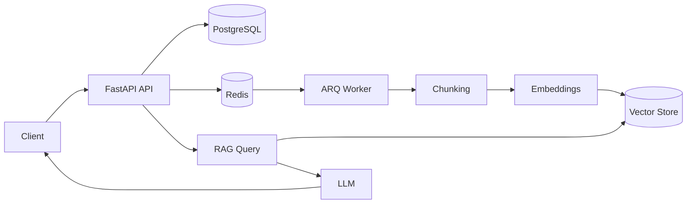

# Atlas RAG Backend

A production-oriented Retrieval-Augmented Generation (RAG) backend built with **FastAPI**, **PostgreSQL**, **Redis**, **SQLAlchemy**, and asynchronous background processing.

> **Current Status:** 🚧 In active development

---

# Features

- ✅ FastAPI REST API
- ✅ PostgreSQL with SQLAlchemy ORM
- ✅ Alembic database migrations
- ✅ Document upload & persistence
- ✅ Job model for async processing
- ✅ Redis integration
- ⏳ ARQ background workers
- ⏳ Document chunking pipeline
- ⏳ Embedding generation
- ⏳ Vector search
- ⏳ RAG query endpoint
- ⏳ Authentication
- ⏳ Docker production deployment

---

# Architecture



### Request flow

1. Client uploads a document.
2. FastAPI stores document metadata in PostgreSQL.
3. A processing job is created.
4. Redis queues the job.
5. ARQ worker performs chunking and embedding.
6. Embeddings are stored in the vector database.
7. User queries are matched against relevant chunks before calling the LLM.

---

# Tech Stack

| Layer | Technology |
|---|---|
| API | FastAPI |
| ORM | SQLAlchemy 2.0 |
| Database | PostgreSQL |
| Cache / Queue | Redis |
| Background Jobs | ARQ |
| Migrations | Alembic |
| Validation | Pydantic |
| Containerization | Docker & Docker Compose |

---

# Project Structure

```text
atlas-rag/
│
├── app/
│   ├── api/              # Route definitions
│   ├── db/               # Database session & models
│   ├── models/           # SQLAlchemy models
│   ├── schemas/          # Pydantic schemas
│   ├── services/         # Business logic
│   ├── workers/          # ARQ worker (upcoming)
│   └── main.py
│
├── alembic/
│
├── docker/
│
├── tests/
│
├── docker-compose.yml
├── Dockerfile
└── README.md
```

---

# Getting Started

## 1. Clone the repository

```bash
git clone https://github.com/yourusername/atlas-rag.git

cd atlas-rag
```

## 2. Create environment file

Create a `.env` file:

```env
DATABASE_URL=postgresql+psycopg://postgres:password@db:5432/atlas
REDIS_URL=redis://redis:6379
OPENAI_API_KEY=your_api_key
```

## 3. Run with Docker

```bash
docker compose up --build
```

Services:

| Service | Port |
|---|---|
| FastAPI | 8000 |
| PostgreSQL | 5432 |
| Redis | 6379 |

API will be available at:

```text
http://localhost:8000
```

Swagger docs:

```text
http://localhost:8000/docs
```

---

# Database Migrations

Create migration:

```bash
alembic revision --autogenerate -m "message"
```

Apply migrations:

```bash
alembic upgrade head
```

Rollback:

```bash
alembic downgrade -1
```

---

# API Documentation

## Health Check

### GET `/health`

Returns API status.

**Response**

```json
{
  "status": "ok"
}
```

---

## Upload Document

### POST `/documents`

Upload a document for processing.

**Request**

Multipart form-data:

| Field | Type |
|---|---|
| file | File |

**Response**

```json
{
  "document_id": "uuid",
  "job_id": "uuid",
  "status": "queued"
}
```

---

## Get Document

### GET `/documents/{document_id}`

Returns stored document metadata.

**Response**

```json
{
  "id": "uuid",
  "filename": "notes.pdf",
  "status": "completed"
}
```

---

## Get Job Status

### GET `/jobs/{job_id}`

Track asynchronous processing.

**Response**

```json
{
  "id": "uuid",
  "status": "processing"
}
```

Possible statuses:

- `queued`
- `processing`
- `completed`
- `failed`

---

## Future Endpoint

### POST `/query`

Retrieve context and generate an LLM answer.

**Request**

```json
{
  "query": "What is RAG?"
}
```

**Planned Response**

```json
{
  "answer": "...",
  "sources": []
}
```

---

# Docker Setup

### Docker Compose

```yaml
services:
  api:
    build: .
    ports:
      - "8000:8000"
    depends_on:
      - db
      - redis

  db:
    image: postgres:17
    ports:
      - "5432:5432"

  redis:
    image: redis:8
    ports:
      - "6379:6379"
```

### Build manually

```bash
docker build -t atlas-rag .
```

Run:

```bash
docker run -p 8000:8000 atlas-rag
```

---

# Development Roadmap

## Phase 1 — Foundation

- [x] FastAPI project setup
- [x] SQLAlchemy models
- [x] PostgreSQL integration
- [x] Alembic migrations
- [x] Redis setup
- [x] Job model

## Phase 2 — Processing Pipeline

- [ ] ARQ worker
- [ ] Background job execution
- [ ] PDF/Text extraction
- [ ] Chunking strategy
- [ ] Embedding generation

## Phase 3 — Retrieval

- [ ] Vector database integration
- [ ] Similarity search
- [ ] Metadata filtering
- [ ] Top-K retrieval

## Phase 4 — Generation

- [ ] RAG query endpoint
- [ ] Context assembly
- [ ] LLM integration
- [ ] Source citations

## Phase 5 — Production

- [ ] Authentication
- [ ] Rate limiting
- [ ] Logging & monitoring
- [ ] CI/CD
- [ ] Deployment

---

# Current Database Models

### Document

| Field | Type |
|---|---|
| id | UUID |
| filename | String |
| created_at | Timestamp |

### Job

| Field | Type |
|---|---|
| id | UUID |
| document_id | UUID (FK) |
| status | JobStatus |

`JobStatus` enum:

- queued
- processing
- completed
- failed

---

# Vision

Atlas aims to be a modular RAG backend where ingestion, retrieval, and generation are cleanly separated, making it easy to swap embedding models, vector stores, or LLM providers without changing the API layer.